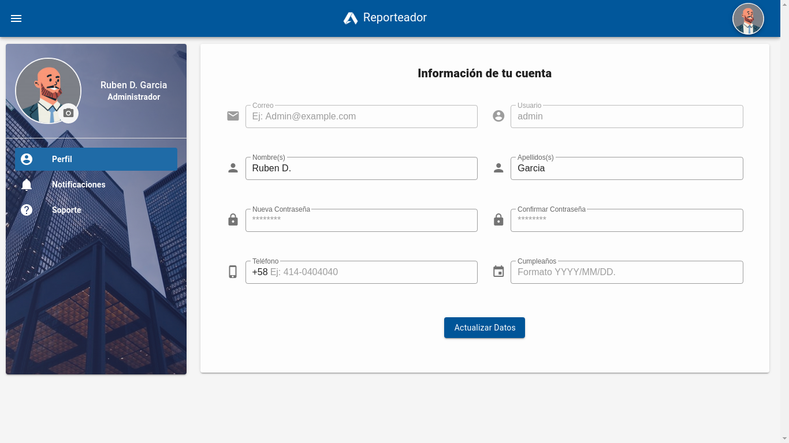
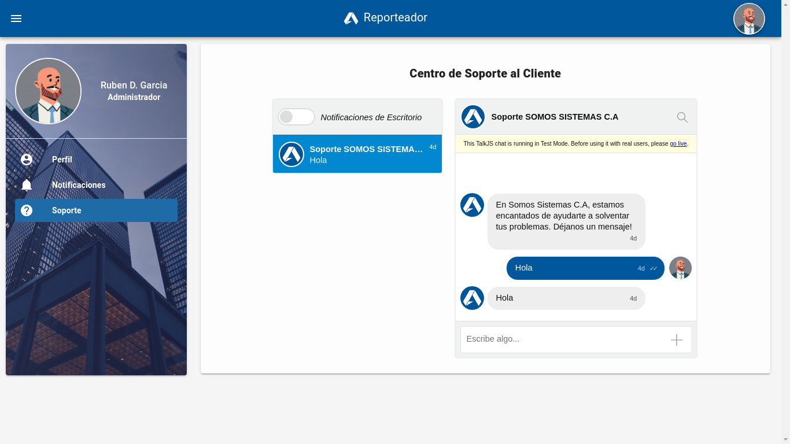
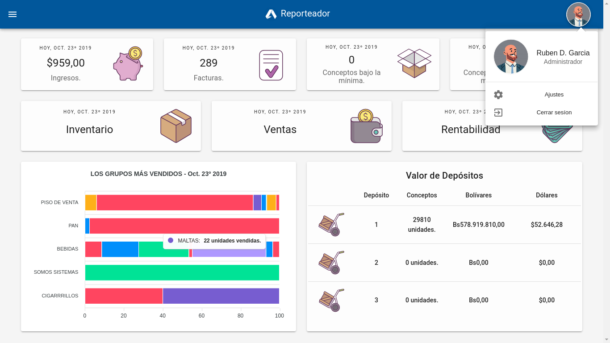
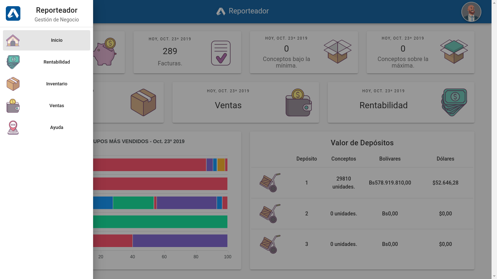
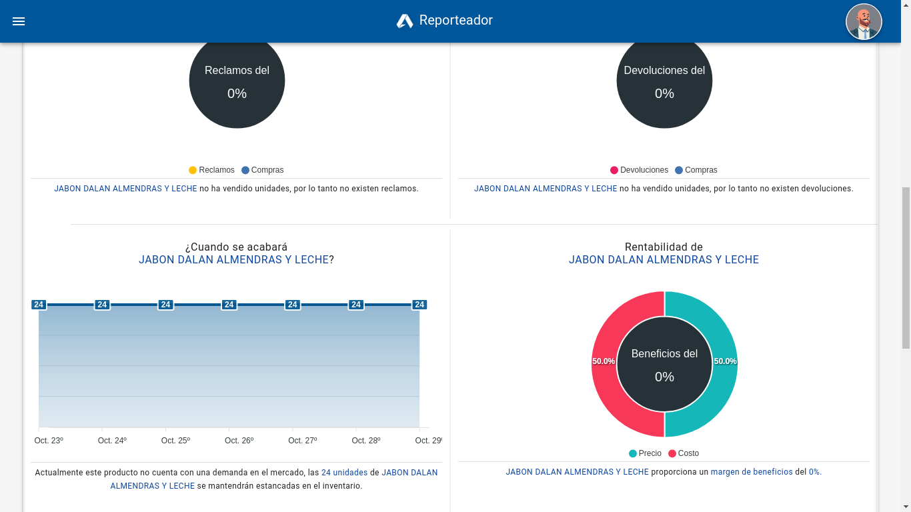
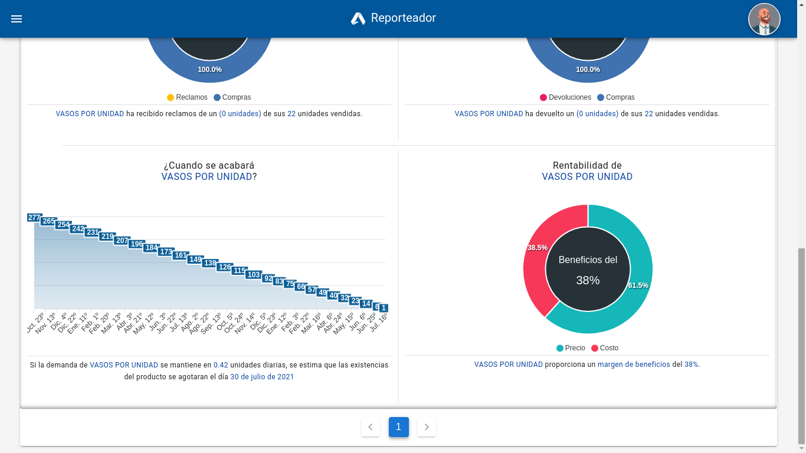
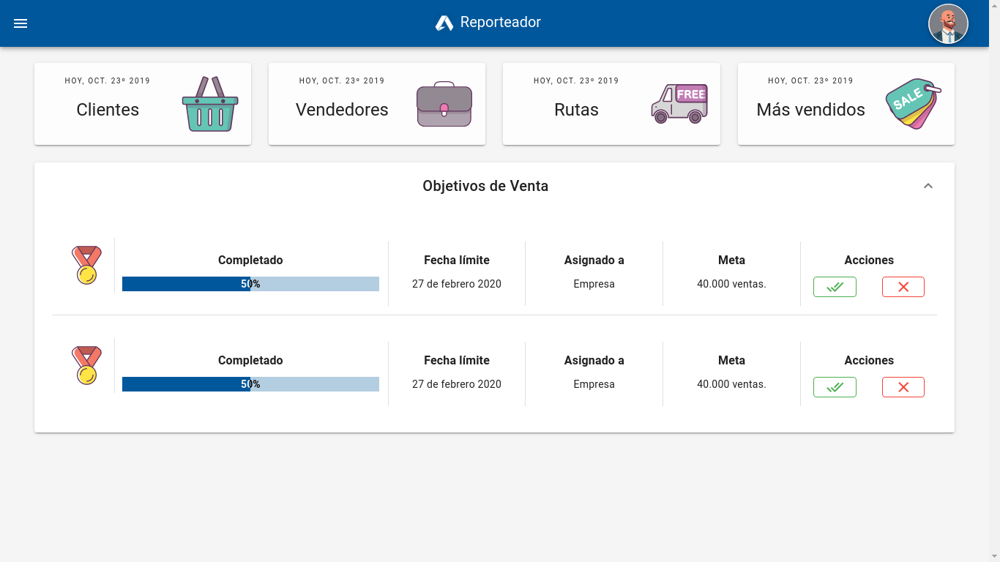
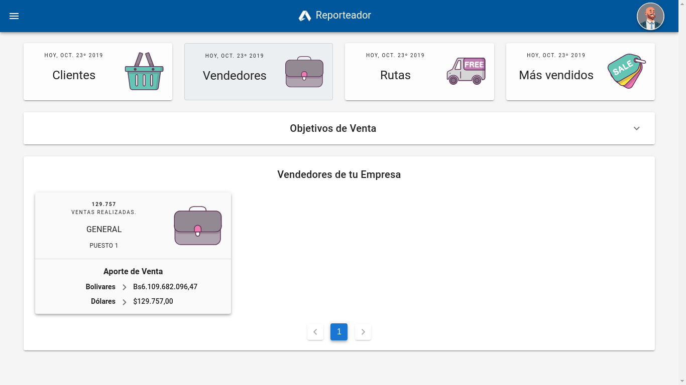
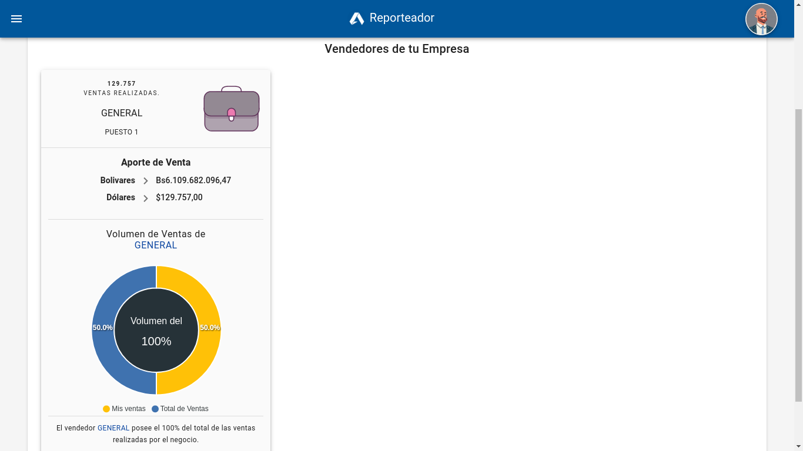
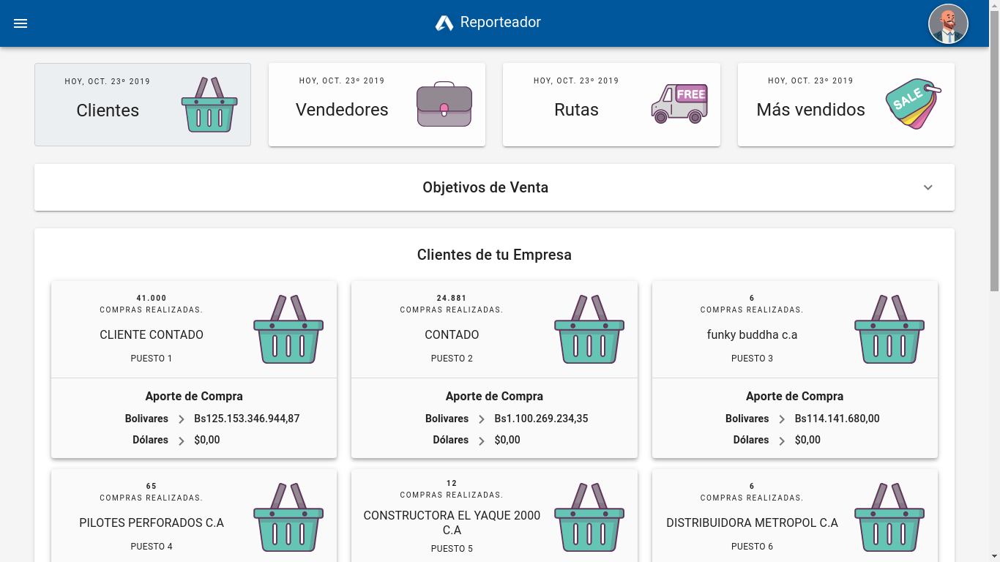

# Reporteador

## English description.

This is a management system for financial intelligence developed during my internships at Somos Sistemas C.A. It is in charge of managing information related to the company that uses it, generating reports that represent support material for decision-making. This project is still under development..

___

## Descripción en español.

Este es un sistema de gestión para la inteligencia financiera desarrollado durante mis pasantias en Somos Sistemas C.A. Se encarga de la gestión de información relacionada con la empresa que lo utiliza, generando reportes que representan un material de apoyo para la toma de decisiones. Este proyecto sigue en desarrollo.

### [Demo](http://reporteadordemo.000webhostapp.com)

## Auth / Login / Password Recover (Inicio de Sesion y Recuperar contraseña)

### Login / Inicio de Sesion

***(English)*** Since it is a management system, it is clearly mandatory for the user to log in before proceeding. Any attempt to access a path through the URL will result in a redirect to this page.

___

***(Español)*** Dado que es un sistema de gestión, es netamente obligatorio que el usuario inicie sesión antes de proceder. Cualquier intento de acceso a una ruta a través de la URL terminará en una redirección hacia esta página.

### Password Recover / Recuperar contraseña

***(English)*** In the event that the user has forgotten their password and thinks that the system is inaccessible, then they do not have to worry, the password can be recovered, since the account has a linked email for these cases.

___

***(Español)*** En el caso de que el usuario haya olvidado su contraseña y piense que el sistema es inaccesible, entonces no tiene que preocuparse, se puede recuperar la contraseña, ya que la cuenta tiene un correo electronico enlazado para estos casos.

### User Profile / Perfil de Usuario

***(English)*** As in any system, you can customize your user profile. It is recommended, and mandatory, to personalize the user's name to the name of your company. Since this directly influences the way in which the SOMOS SISTEMAS C.A customer service center will be able to identify and assist you.

___

***(Español)*** Como en cualquier sistema, puedes personalizar tu perfil de usuario. Es recomendado, y de manera obligatoría, personalizar el nombre del usuario al nombre de tu compañía. Ya que esto influye directamente en la manera en la que el centro de atención al cliente de SOMOS SISTEMAS C.A podrá identificarte y atenderte.

### Client assist / Perfil de Usuario

***(English)*** The system has an integrated CHAT, to communicate from **Reporteador*** to **Reporteador***, from your user profile to a customer service account at the hands of SOMOS SISTEMAS A.C, where you can express the problem that it ails you and they give a pertinent solution to it as soon as possible.

___

***(Español)*** El sistema cuenta con un CHAT integrado, para realizar comunicación de **Reporteador** a **Reporteador**, desde tu perfil de usuario a una cuenta de atención al cliente a manos de SOMOS SISTEMAS C.A, por donde podrás manifestar el problema que te aqueja y ellos dar una pertinente solución al mismo en la brevedad posible.

## Dashboard.

***(English)*** Once the credentials have been verified, the user will be able to access the management system. The first thing you will see is this Dashboard, with information related to your movements for the day.

___

***(Español)*** Una vez que las credenciales han sido comprobadas, el usuario podrá acceder al sistema de gestión. Lo primero que verá será este Dashboard, con información relacionada a sus movimientos del día.

## Inventory / Inventario.

***(English)*** In this module the user is able to see all the concepts (products) that have been registered by the company, and in the same way, information related to them. Includes statistical analysis of the movements of each product. All the data can be filtered & ordered with the controls inside the table

___

***(Español)*** En este módulo el usuario es capaz de ver todos los conceptos (productos) que han sido registrados por la empresa, y de la misma manera, información relacionada a los mismos. Incluye analisis estadisticos de los movimientos de cada producto. Toda la información puede ser ordenada y filtrada con los controles añadidos en la tabla.

### Concept (Product) / Concepto (Producto)
***(English)*** Each concept has information related to its registration, and its stocks in the warehouse.

___

***(Español)*** Cada concepto posee información relacionada con su registro, y sus existencias en el almacen.
 

### Charts / Gráficos

***(English)*** Each concept has a series of graphics related to a type of report. The results obtained by them are those that will be used by the company to determine profitability indicators and other variables to improve the company's productivity.

___

***(Español)*** Cada concepto posee una serie gráficos relacionados con un tipo de reporte. Los resultados arrojados por los mismos son los que serán utilizados por la empresa para determinar indicadores de rentabilidad y otras variables para mejorar la productividad de la empresa.

#### Stock Rotation & Weekly demand / Rotación de Inventario & Demanda Semanal

***(English)*** Charts to communicate the weekly demand for the concept, and the turnover index it has in inventory, that is, how much it moves in the market.

___

***(Español)*** Gráficas para comunicar la demanda semanal del concepto, y el indice de rotación que tiene en el inventario, es decir, que tanto se mueve el mismo en el mercado.

#### Stock claims & Stock devolutions / Reclamos y devoluciones del Inventario

***(English)*** Charts to determine the rate of claims and returns that a concept has in the market. Depending on the results, this may affect the possibility of ceasing to distribute this concept.

___

***(Español)*** Gráficas para determinar el indice de reclamos y devoluciones que tiene un concepto en el mercado. Dependiendo de los resultados, esto puede incidir en la posibilidad de dejar de distribuir este concepto.

#### Stock depletion && Cost effectiveness & Agotamiento de inventario y Rentabilidad

***(English)*** Charts indicating an estimated date for stock depletion. With this, the company can take the necessary measures to replenish stocks. This is calculated from the weekly demand that a concept has. In addition to this, there is profitability, a relational calculation between the concept's purchase cost and its retail price. A value of around 30% is usually expected.

___

***(Español)*** Gráficas que indican una fecha estimada para el agotamiento de las existencias. Con esto la empresa puede ir tomando las medidas necesarias para reponer las existencias. Esto se calcula a partir de la demanda semanal que tiene un concepto. Aunado a ello, está la rentabilidad, calculo relacional entre el costo compra del concepto y su precio de venta al público. Usualmente se espera un valor alrededor del 30%.

## Sales / Ventas.

***(English)*** Every company needs to know what happens to their sales and income, in the same way, set sales objectives to determine how profitable the business is being.

___

***(Español)*** Toda empresa necesita saber que sucede con su ventas e ingresos, de la misma manera, plantear objetivos de venta para determinar que tan rentable está siendo el negocio.

### Concepts ranking by sales / Ranking de conceptos por venta.

***(English)*** In this view you can see a sales ranking for the products offered by your company, in this way you can keep track of what you want to continue selling, and what you don't.

___

***(Español)*** En esta vista puedes observar un ranking de ventas para los productos ofrecidos por tu empresa, de esta manera puedes llevar un control de lo que quieres seguir vendiendo, y lo que no.

### Sellers of your company / Vendedores de tu compañía.

***(English)*** You will be able to see a list of the sellers registered by your company, and observe the sales volume in which this influences the business. From this, you can determine which salespeople do their job more efficiently.

___

***(Español)*** Podrás ver un listado de los vendedores registrado por tu compañía, y observar el volumen de ventas en las que este influye en el negocio. A partir de ello, puedes determinar que vendedores cumplen con su trabajo de manera más eficiente.

### Clients of your company / Clientes de tu compañía.

***(English)*** You will be able to keep a record of clients who have a business relationship with your company, from a client counted for daily care, to companies to which the business provides goods and supplies.

___

***(Español)*** Podrás llevar un registro de clientes que tienen contacto en relación de negocios con tu compañía, desde un cliente contado para la atención diaria, hasta compañías a las que el negocio provee bienes e insumos.

Coded with :heart: by [Rubén García](https://rubengarcia.herokuapp.com/)
